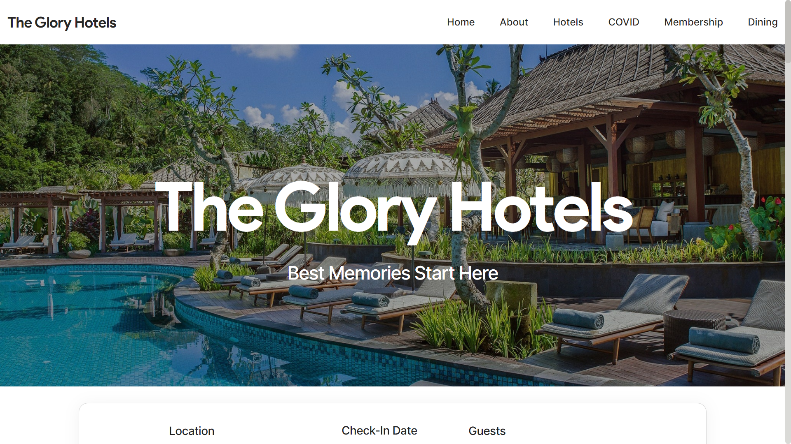

     
  <a target="blank" href="https://gloryhotels.vercel.app/"><strong>Explore the app here »</strong></a>

# Glory Hotels
Website to showcase a chain of hotel, it includes pages such as about, hotel, covid protocols, membership and dining.

# Built With
* Frontend - HTML, CSS
* Backend - JavaScript
* Deployment Platform - Vercel

# Screenshots
Main Page

# Future Goals
* To integrate the payment gateway like razorpay
* To add backend for all the data submited
* To improve the UI/UX of the website

# License

The project is acquired under the [MIT License](https://docs.github.com/en/repositories/managing-your-repositorys-settings-and-features/customizing-your-repository/licensing-a-repository#disclaimer).
